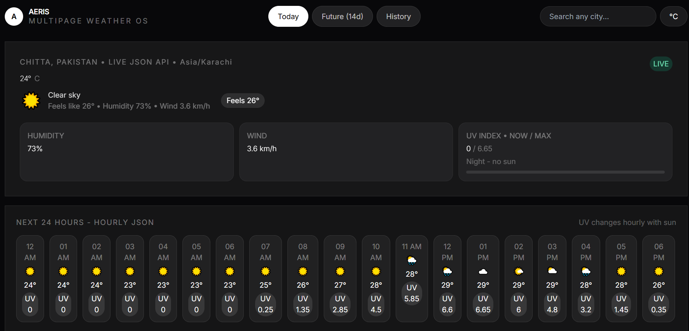
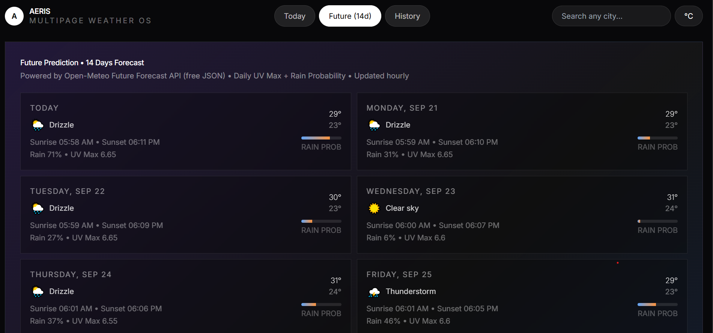
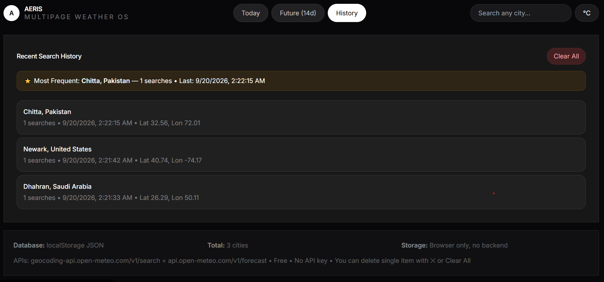

<div align="center">


# AERIS — Multipage Weather Intelligence OS

**A beautiful, fast, and privacy-first weather platform with 3 pages, free Open-Meteo JSON API, local DB, search history, and 14-day future prediction.**

[](https://aeris-weather.vercel.app)
[](https://react.dev)
[](https://vitejs.dev)
[](https://tailwindcss.com)
[](LICENSE)

[Live Website](https://aeris-weather.vercel.app) • [Report Bug](https://github.com/SayakaMeem/aeris-weather/issues) • [Request Feature](https://github.com/SayakaMeem/aeris-weather/issues)

</div>

---

## 🌦️ Live Preview

> **🔴 LIVE LINK:** https://aeris-weather.vercel.app

> If your Vercel URL is different, replace it: `https://aeris-weather-YOURNAME.vercel.app`

---

## ✨ Features

### 🌍 3 Professional Pages (React Router)
| Page | Route | What it does |
|------|-------|--------------|
| **Today** | `/` | Live current weather + feels like + humidity + wind + UV now/max + 24h hourly + geolocation |
| **Future** | `/future` | 14-day forecast + sunrise/sunset + rain % + UV max + UV trend graph |
| **History** | `/history` | LocalStorage JSON DB + most frequent city + delete single + clear all + click to load |

### ⚡ Core Qualities
- ✅ **FREE JSON API** - `geocoding-api.open-meteo.com` + `api.open-meteo.com` - No API key
- ✅ **Place-wise search** - Search any city: `Tokyo`, `Dhaka`, `New York`
- ✅ **Local Database** - `localStorage` JSON - 30 cities, count, last searched
- ✅ **Most Frequently Searched** - Auto-sorted by `count`
- ✅ **Delete History** - Single ✕ delete + Clear All
- ✅ **UV Index Fixed** - Shows `0 / max` at night, changes hourly, color bar
- ✅ **Dynamic Units** - °C / °F toggle
- ✅ **Auto Location** - `navigator.geolocation` + reverse geocode

---

## 🛠️ Tech Stack

- **Frontend:** React 18, React Router DOM 6, Vite 5
- **Styling:** Tailwind CSS 3.4, Inter Font, Glassmorphism
- **API:** Open-Meteo Geocoding + Forecast (free)
- **Database:** localStorage JSON (no backend)
- **Deploy:** Vercel

---

## 📁 Folder Structure

aeris-weather/
├── public/
├── screenshots/
│ ├── home.png
│ ├── future.png
│ └── history.png
├── src/
│ ├── pages/
│ │ ├── Home.jsx → Today page
│ │ ├── Future.jsx → 14-day future
│ │ └── History.jsx → History + DB
│ ├── App.jsx → Router + Search + API
│ ├── db.js → localStorage + icons
│ ├── main.jsx → BrowserRouter
│ └── index.css → Tailwind
├── index.html
├── tailwind.config.js
├── vite.config.js
└── package.json

Code

---

## 🚀 Quick Start

```bash
# 1. Clone
git clone https://github.com/SayakaMeem/aeris-weather.git
cd aeris-weather

# 2. Install
npm install

# 3. Run dev
npm run dev
# → http://localhost:3000

# 4. Build
npm run build

14 lines hidden
🔌 API Used (Free, No Key)
http
# Search city
GET https://geocoding-api.open-meteo.com/v1/search?name=Chittagong&count=6&language=en

# Weather - current + hourly + 14-day + UV
GET https://api.open-meteo.com/v1/forecast?latitude=22.3569&longitude=91.7832&current=temperature_2m,relative_humidity_2m,apparent_temperature,weather_code,wind_speed_10m,uv_index&hourly=temperature_2m,weather_code,uv_index&daily=weather_code,temperature_2m_max,temperature_2m_min,sunrise,sunset,precipitation_probability_max,uv_index_max&timezone=auto&forecast_days=14
💾 Database Schema (localStorage: aeris_history)
JSON
Tree
Raw
▶
[
▶
{
"id"
:
171234567890,
"name"
:
"Tokyo",
"country"
:
"Japan",
"lat"
:
35.6897,
"lon"
:
139.6922,
"count"
:
5,
"lastSearched"
:
"2026-09-20T06:36:00.000Z"
}
]
📸 Screenshots
<div align="center">
Today Page

Future 14 Days

History DB




</div>
🌙 Why UV shows 0?
At night (like 12:36 AM in your screenshot) UV is always 0 — no sun. AERIS shows 0 / 9.2 max + color bar. At noon it shows 7.5 / 9.2. Hourly cards also show UV per hour, so UV changes.

🚀 Deploy to Vercel
Push to GitHub
Go to https://vercel.com/new → Import aeris-weather
Framework: Vite, Build: npm run build, Output: dist
Deploy → Live!
<div align="center">
Built with ❤️ by SayakaMeem • AERIS Weather OS

Footer

</div>
Code